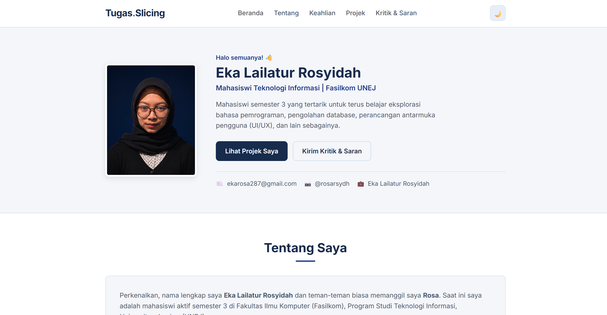

# Tugas Pemrograman Berbasis Web (PWEB) - Portofolio Sederhana

Repositori ini berisi tugas individu mata kuliah **Pemrograman Berbasis Web** untuk membuat antarmuka website portofolio pribadi sederhana, responsif, dan interaktif menggunakan standar web murni (HTML5, Plain CSS, dan JavaScript).

---

## 👤 Identitas Mahasiswa

- **Nama Lengkap** : Eka Lailatur Rosyidah (Rosa)
- **NIM**          : *252410102069*
- **Program Studi**: Teknologi Informasi
- **Fakultas**     : Fakultas Ilmu Komputer (Fasilkom)
- **Perguruan Tinggi**: Universitas Jember (UNEJ)
- **Semester**     : 3 (Tiga)
- **Asal Daerah**  : Mojokerto, Jawa Timur

---

## 🌐 Tautan Pengumpulan

## 🌐 Tautan Pengumpulan

- **Link Deployment** : https://rosarsydh.github.io/tugas-pweb/
- **Link Repositori** : https://github.com/rosarsydh/tugas-pweb

---

## 📸 Tangkapan Layar (Screenshot)

> *Simpan tangkapan layar tampilan websitemu dengan nama `preview.png` pada folder ini.*



---

## 💡 Deskripsi Singkat & Fitur Website

Website ini dibuat dengan tampilan **sederhana, dan menarik**:

1. **Desain Responsif (RWD)**:
   - Nyaman dilihat di layar HP, tablet, maupun laptop/desktop.
   - Menu navigasi mobile otomatis berubah menjadi tombol menu yang dapat dibuka/tutup secara dinamis.
2. **Color Palette Navy & Putih**:
   - Nuansa warna biru navy yang elegan dipadukan dengan putih bersih.
   - Dilengkapi fitur **Mode Gelap (Dark Mode)** dan **Mode Cerah (Light Mode)**.
3. **Bagian Konten**:
   - **Profil & Foto Identitas**: Menampilkan foto profil asli beserta identitas mahasiswa dari Mojokerto yang berkuliah di UNEJ.
   - **Keahlian & Tools**: Daftar kemampuan praktis mahasiswa (Figma, Canva, PostgreSQL, Python, C#, HTML, Arduino, CapCut).
   - **2 Projek Kuliah Nyata**:
     1. **Agromame**: Sistem pendataan produksi dan stok edamame di PT. Mitratani Dua Tujuh (Jember) menggunakan Python Console dan integrasi Database PostgreSQL.
     2. **CFMART**: Sistem aplikasi desktop kasir dan manajemen resto olahan ikan lele berbasis OOP C# yang terintegrasi dengan PostgreSQL tingkat lanjut.
   - **Kritik & Saran (Bisa Anonim)**: Formulir interaktif untuk menerima masukan (bisa diisi nama atau dibiarkan anonim). Masukan yang dikirim langsung ditampilkan secara dinamis di layar menggunakan manipulasi JavaScript DOM tanpa perlu reload halaman.
   - **Tautan Media Sosial**: Instagram (`@rosarsydh`), Email (`ekarosa287@gmail.com`), dan LinkedIn (`Eka Lailatur Rosyidah`).

---

## 🛠️ Teknologi yang Digunakan

- **HTML**: Struktur dokumen semantik sederhana.
- **CSS**: CSS Grid, CSS Variables untuk mode gelap/cerah, dan media,responsif.
- **JavaScript**: Manipulasi DOM untuk pergantian tema, menu mobile, validasi form, dan render pesan kritik/saran secara dinamis.

---

## 📂 Struktur Berkas

```text
Tugas PWEB/
│
├── index.html                  # Halaman web utama
├── README.md                   # Dokumentasi tugas
├── preview.png                 # Tangkapan layar website
│
└── assets/
    ├── css/
    │   └── style.css           # Styling Plain CSS (Palette Navy & Putih)
    ├── js/
    │   └── script.js           # Kode interaktif Vanilla JS (DOM)
    └── img/
        ├── foto-profil.jpg     # Foto profil mahasiswa
        ├── project-agromame.svg# Mockup visual projek Agromame
        └── project-cfmart.svg  # Mockup visual projek CFMART
```

---

## 🚀 Panduan Menjalankan & Deployment

### 1. Menjalankan di Komputer Lokal
- Buka folder `Tugas PWEB`, lalu klik dua kali berkas `index.html` untuk membukanya di browser (Chrome, Edge, dll.).

### 2. Deploy ke GitHub Pages (Gratis)
1. Buat repositori baru di GitHub dengan nama bebas (misal `portofolio-pweb`).
2. Jalankan perintah git pada terminal folder ini:
   ```bash
   git init
   git add .
   git commit -m "feat: inisialisasi website portofolio tugas pweb"
   git branch -M main
   git remote add origin https://github.com/rosarsydh/tugas-pweb.git
   git push -u origin main
   ```
3. Di halaman GitHub repo kamu, klik **Settings** > **Pages** > pilih branch `main` folder `/(root)` > klik **Save**.
4. Dalam 1–2 menit, link websitemu sudah aktif!

### 3. Deploy ke Netlify (Paling Cepat Tanpa Perlu Git)
1. Buka [app.netlify.com](https://app.netlify.com/).
2. Tarik (drag & drop) seluruh folder `Tugas PWEB` ke halaman Netlify.
3. Website kamu langsung aktif online dan tautannya siap dikumpulkan ke dosen/aslab!
